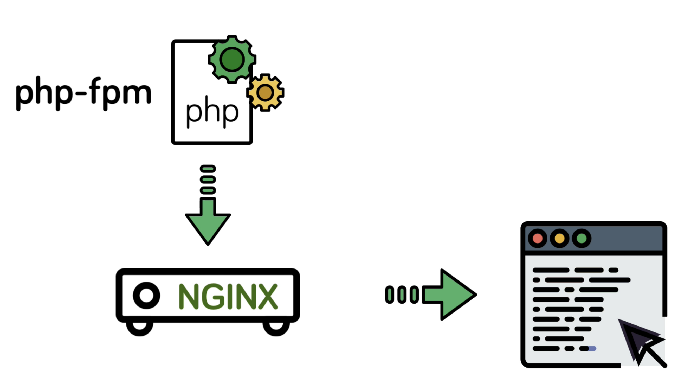

# NGINX Fundamentals: High-Performance Servers from Scratch

[Learn more](https://www.udemy.com/course/nginx-fundamentals/)

- [NGINX Fundamentals: High-Performance Servers from Scratch](#nginx-fundamentals-high-performance-servers-from-scratch)
  - [1. Overview](#1-overview)
  - [2. Installation](#2-installation)
    - [2.1. Prepare ubuntu server](#21-prepare-ubuntu-server)
    - [2.2. Installing via a Package manager](#22-installing-via-a-package-manager)
    - [2.3. Building Nginx from source & adding modules](#23-building-nginx-from-source--adding-modules)
    - [2.4. Adding an Nginx service](#24-adding-an-nginx-service)
  - [3. Configuration](#3-configuration)
    - [3.1. Terms](#31-terms)
    - [3.2. Creating a virtual host](#32-creating-a-virtual-host)
    - [3.3. Location context (Location block)](#33-location-context-location-block)
    - [3.4. Variables](#34-variables)
    - [3.5. Rewrite & Redirect](#35-rewrite--redirect)
    - [3.6. Try Files & Named locations](#36-try-files--named-locations)
    - [3.7. Logging](#37-logging)
    - [Inhteritance & Directive types](#inhteritance--directive-types)
    - [PHP Processing](#php-processing)
  - [4. Performance](#4-performance)
  - [5. Security](#5-security)
  - [6. Reverse Proxy & Load Balancing](#6-reverse-proxy--load-balancing)

## 1. Overview

Nginx

- Web server
- Reverse proxy server (core)

Nginx vs Apache

Apache:

- Prefork mode: spawns several processes, each can serve a single request at a time such as PHP request, images, videos,...
- Limit by pre-config number of processes (concurrency)

Nginx:

- Deals with requests asynchronously: single engine process can serve multiple requests concurrently
- Can't embed programming language into its processes
- Dynamic content must be dealt with by a completely separate process like `PHP FPM` and then reverse proxy
  back to the client via `Nginx`
- `Nginx` can serve static resource without `PHP` ever knowing about it.
- Limit by system resources (concurrency)

Nginx is faster than Apache

- Faster static resources
- Higher concurrency

Configuration

- Nginx: URI location first
- Apache: Filesystem location (`.htaccess` file)

## 2. Installation

### 2.1. Prepare ubuntu server

- Via `docker`
- `docker pull ubuntu:18.04`
- `docker run --name ubuntu -p 8000:80 -d ubuntu:18.04`
- `docker exec -it ubuntu /bin/bash`

- Using docker images with `systemd` enable: [https://hub.docker.com/r/jrei/systemd-ubuntu](https://hub.docker.com/r/jrei/systemd-ubuntu)

### 2.2. Installing via a Package manager

Overview:

- Quick & easy solution
- Limited install options
- No support for additional modules

> Suitable for the most basic web servers or testing & development

Install via `apt`

- `apt-get update`
- `apt-get install nginx`

Check if we successfully install `nginx`

- `ps aux | grep nginx`

### 2.3. Building Nginx from source & adding modules

- Prepare

  - [nginx.org](nginx.org)
  - [nginx.com](nginx.com)

- Download

  - `wget https://nginx.org/download/nginx-1.23.2.tar.gz`
  - `tar -zxvf nginx-1.23.2.tar.gz`

- Install some dependencies needs to compile `nginx`:

  - Run `./configure` inside folder `nginx-1.23.2.tar.gz`
  - `apt-get install build-essential`
  - Run `./configure`, check missing dependencies and install them
  - `apt-get install libpcre3 libpcre3-dev zlib1g zlib1g-dev libssl-dev`

- Add some `flags`

  - `./configure --help`
  - [Learn more](http://nginx.org/en/docs/configure.html)
  - `./configure --sbin-path=/usr/bin/nginx --conf-path=/etc/nginx/nginx.conf --error-log-path=/var/log/nginx/error.log --http-log-path=/var/log/nginx/access.log --with-pcre --pid-path=/var/run/nginx.pid --with-http_ssl_module`

- Add some `modules` to extend the standard ngnix functionality

  - pagespeed
  - SSL

  - 2 forms:
    - `bundle modules`
    - `3rd-party modules`

- Compile source: `make`
- Install the compiled source: `make install`
- Check configuration files: `ls -l /etc/nginx`
- Test `nginx` executable command: `nginx -V`
- Start `nginx`: `nginx`
- Check running processes: `ps aux | grep nginx`
- Navigate to `http://127.0.0.1:8000`

- See all bundle modules at: [http://nginx.org/en/docs/](http://nginx.org/en/docs/)@module references

### 2.4. Adding an Nginx service

- Using `systemd` service

  - [Learn more](https://www.freedesktop.org/wiki/Software/systemd/)
  - `ubuntu 15.04`
  - `centos 7.0`
  - start, stop & restart
  - reload (configuration)
  - start on boot

- Using standard `nginx commandline tool`

  - Check processes: `ps aux | grep nginx`
  - Send stop signal: `nginx -s stop`

- Enable `systemd` service

  - [Script](https://www.nginx.com/resources/wiki/start/topics/examples/systemd/)
  - `touch /lib/systemd/system/nginx.service`
  - Paste the script content

  - ```service
    [Unit]
    Description=The NGINX HTTP and reverse proxy server
    After=syslog.target network-online.target remote-fs.target nss-lookup.target
    Wants=network-online.target

    [Service]
    Type=forking
    PIDFile=/var/run/nginx.pid
    ExecStartPre=/usr/bin/nginx -t
    ExecStart=/usr/bin/nginx
    ExecReload=/usr/bin/nginx -s reload
    ExecStop=/bin/kill -s QUIT $MAINPID
    PrivateTmp=true

    [Install]
    WantedBy=multi-user.target
    ```

- Start: `systemctl start nginx`
- Start `nginx` on `boot`: `systemctl enable nginx`

## 3. Configuration

### 3.1. Terms

The most important terms:

- Context
- Directive

Directive is a specific configuration option that get set in the configuration
files and consist of a name and a value:

- `server_name mydomain.com`

Context is section within the configuration file where directives can be set for that
given context.

Essentially, context is the same as scope.

Context are also nested and inherit from their parents with the top most
context simply being the `configuration` file itself. This is call the `main context`
and is where we configure `global directive` that apply to the `master` process.

Other important context includes:

- `http`: anything `HTTP` related
- `server`: define a `virtual host` (similiar to `Apache` v-host)
- `location`: for matching `URI` location on incomming requests to the parent server context

### 3.2. Creating a virtual host

We will create a basic `virtual host` to serve static files from a directory on our server.

Overview:

- Create folder `/sites/demo` on our server
- Folder structure:
  - `index.html`
  - `thumb.png`
  - `styles.css`
  - `script.js`

Open the configuration file at `/etc/nginx/nginx.conf` and delete all content.

Start configuring from scratch

```conf
events { }

include mime.types;

http {
    server {
        listen 80;
        server_name localhost;

        root /sites/demo;
    }
}
```

Define a `virtual host`, each virtual host being a new server `context` (or server `block`)

Server context responsible for:

- listening requests on a port (typically `80` for `http` and `443` for `https`)
- `server_name`: domain, subdomain or an `ip` address
- `root`: the root path. For example, if we request url is `/images/cat.png`, `nginx` will
  look for that images at `/root/path/images/cat.png`. In our demo example, the `root` path
  will be `/sites/demo`

Reload the `nginx` configuration:

- Verify the configuration file: `nginx -t`
- Reload nginx: `systemctl reload nginx`
- Head over to `localhost:8000` (mapping port `8000:80` when running `docker container`)

Correct the `MIME type`, we need to provide `nginx` with content types for
given file extensions. We can do this by using a new `context` called `types`.
Each `entry` include `MINEtype` and the corresponding `extension`

```conf
http {
    ...

    types {
        text/html html;
        text/css css;
        text/javascript js;
    }
}
```

The easy way is to include the `mime.types` from `/etc/nginx/` folder

```conf
http {
    // relative to the current configuration file
    include mime.types;
}
```

> Disable cache on the browser to load new content each time we reload the nginx server.

### 3.3. Location context (Location block)

This is the most used context in any `nginx` configuration. This is where we define
and configure the specific behavior of an `URI`.

```conf
server {
    location uri {

    }
}
```

Think of `location block` as `intercepting` a request based on its value (`uri`), and then doing
something other than just trying to serve a matching file `relative` to the `root` directory.

```conf
events { }

include mime.types;

http {
    server {
        listen 80;
        server_name localhost;

        root /sites/demo;

        location /greeting {
            return 200 "Hello world from nginx /greeting location";
        }
    }
}
```

- Define `location block` that takes an `argument` for the `URI`
- Inside the block, we can now:
  - Response
  - Redirect
  - Do whatever else we need to do with this request and essentially manipulate the response

For example, we can return a `text string`.

```conf
location /greeting {
    return 200 "Hello world from nginx /greeting location";
}
```

There are several ways of matching `URI` in the `location` block.

- Prefix match `location /greeting`, it matches all `URL` starting with `/greeting` such as `/greeting/hieu` or `/greeting/ha`,...
- Exact match `location = /greeting` (the `=` is called the `modifier`)
- Regex match (from the `pcre` library that we have installed already)

  - `location ~ /greeing[0-9]`, it matches all routes like `/greeting1`, `/greeting2`, ... `/greeting9`
  - `~` modifier is `case sensitive`, so if we head over to `/GREETING1`, we will get the `404 page`
  - `~*` modifier is `case insensitive`

- Preferential prefix using `^~` modifier, the same as basic `prefix match`, but higher `priority` than `regex` match.

Match modifier priority:

- Exact `=`
- Preferential prefix `^~`
- Regex `~*`
- Prefix `/`

### 3.4. Variables

Variables exist in 2 forms:

- Configuration variables: we set ourself: `set $var 'something'`
- NGINX module varialbes `$http, $uri, $args`

[Learn more about NGINX module variables](http://nginx.org/en/docs/varindex.html)

- `$host`: current host
- `$uri`: current request path
- `$args`: params
- `/post?user=hieu&age=20`:
  - `$arg_user`: `hieu`
  - `$arg_age`: `20`

```conf
events {}
http {
    include mime.types;

    server {
        listen 80;
        server_name localhost;

        root /sites/demo;

        location /inspect {
            return 200 "$host $uir $args";
        }
    }
}
```

Create local variable

```conf
set $name = 'hieu';

if ( $name ~ 'ha' ) {
    set $name = 'ha'
}
```

[If is evil when used in location context](https://www.nginx.com/resources/wiki/start/topics/depth/ifisevil/)

### 3.5. Rewrite & Redirect

> Rewrite or simply redirect in some cases.

There are 2 directives that we can use for rewritting requests:

- `rewrite pattern URI`
- `return status URI`

We use `return` directive for responsing some data to the client.
However, when the `status` is `3xx`, the second parameter accept
an `URI` for path.

Using `return` directive:

```conf
events {}
http {
    server {
        # ...
        location /logo {
            return 307 /thumb.jpg;
        }
    }
}
```

- `307`: temporary redirect
- when we head over to `/logo`, we get the `/thumb.jpg` image
- the `URL` also `changed` to `/thumb.jpg` (**the main different between rewrite and redirect**)

A redirect simply tells the client performing the request where to go instead.

A rewrite, on the other hand, mutate the `URI` internally

Using `rewrite` directive:

```conf
events {}
http {
    server {
        # ...
        rewrite ^/user/(\w+) /greet/$1;

        location /logo {
            return 307 /thumb.jpg;
        }

        location /greet {
            return 200 "Hello user";
        }

        location = /greet/hieu {
            return 200 "Hello Hieu";
        }
    }
}
```

- When `URL` is rewritten, it also gets re-evaluated by `nginx` as a `completely new request`
- The re-evaluation makes rewrite very powerful, but also requires more system resources.
- When we head over to `/user/hieu`, we get `"Hello user"`, the `URL` is rewritten internally,
  unbeknownst to the client
- We can capture certain parts of the `URI` when `rewrite` by using standard `regex capture group`

Provide `last` `flag` when using `rewrite`

```conf
rewrite ^/user/(\w+) /greet/$1;
rewrite /greet/hieu /thumb.jpg;
```

When we access `user/hieu`, we will get the `/thumb.jpg`. To prevent that, we could use

```conf
rewrite ^/user/(\w+) /greet/$1 last;
rewrite /greet/hieu /thumb.jpg;
```

### 3.6. Try Files & Named locations

`try_files` directive

- can be used in `server` context and get applied for all incomming requests
- can be used inside `location` context and get applied to that `URL` only
- third kind of rewrite and redirect

`try_files` allows us to have `nginx` engine check for the resource to respond with
in any number of locations relative to the `root` directory, with the **final argument**
that results in a `rewrite` and `re-evaluation`, as with the `rewrite` directive.

`try_files path1 path2 final`

```conf
events {}
http {
    server {
        listen 80;
        server_name localhost;

        root /sites/demo;

        try_files /thumb.jpg /404.jpg /not-found;

        location /not-found {
            return 404 "not found";
        }
    }
}
```

- If we have `/thumb.jpg`, serves it
- Else if we have `/404.jpg`, serves it
- Else we `rewrite` the `URL` to `/not-found` and have the `nginx` re-evaluted itself to match
  the location `/not-found` and respond the text `"not found"` to the client.

Typically, the `try_files` directive is used with `nginx` variable `$uri` to first check
the file matched the `$uri`

```conf
events {}
http {
    server {
        listen 80;
        server_name localhost;

        root /sites/demo;

        try_files $uri /404.jpg /not-found;

        location /not-found {
            return 404 "not found";
        }
    }
}
```

Named location simply means assigning a name to a location context, and a directive such
as `try_files` use that location by its name. Ensuring `no re-evaluation` has to happen
on the final argument, but instead just a direct call to the `named location`.

```conf
events {}
http {
    server {
        listen 80;
        server_name localhost;

        root /sites/demo;

        try_files $uri /404.jpg @not_found;

        location @not_found {
            return 404 "not found";
        }
    }
}
```

### 3.7. Logging

Nginx provides 2 log types:

- error log

  - anything that failed
  - anything that didn't happen as expected

- access log: log all requests to the server

> Logging is enable by default

When compile `nginx`, we have setup the log path at: `/var/log/nginx`

We can also create `custom log` or `disable logging` for a `given context` by using the directives:

- `access_log`
- `error_log`

```conf
events {}
http {
    server {
        listen 80;
        server_name localhost;

        root /sites/demo;

        location /secure {
            access_log /var/log/nginx/secure.access.log;
            return 200 "Welcome to secure area";
        }
    }
}
```

Another common use of the `log` directive is to disable logging for certain requests.
By doing so, we can reduce server load and keep log file simple.

```conf
events {}
http {
    server {
        listen 80;
        server_name localhost;

        root /sites/demo;

        location /secure {
            access_log off;
            return 200 "Welcome to secure area";
        }
    }
}
```

### Inhteritance & Directive types

As with `scope` in programming languages, an `nginx` context inherits configurations from its parent contexts.

```conf
server {
    root /sites/demo;

    location / {
        # inherit root
        # root /sites/demo;
    }
}
```

The inheritance isn't always as `scope`, but depends on the type of `directive` being inherited from.

There are 3 main directive types:

- Standard directive
- Array directive
- Action directive

```conf
events {}

######################
# (1) Array Directive
######################
# Can be specified multiple times without overriding a previous setting
# Gets inherited by all child contexts
# Child context can override inheritance by re-declaring directive
access_log /var/log/nginx/access.log;
access_log /var/log/nginx/custom.log.gz custom_format;

http {

  # Include statement - non directive
  include mime.types;

  server {
    listen 80;
    server_name site1.com;

    # Inherits access_log from parent context (1)
  }

  server {
    listen 80;
    server_name site2.com;

    #########################
    # (2) Standard Directive
    #########################
    # Can only be declared once. A second declaration overrides the first
    # Gets inherited by all child contexts
    # Child context can override inheritance by re-declaring directive
    root /sites/site2;

    # Completely overrides inheritance from (1)
    access_log off;

    location /images {

      # Uses root directive inherited from (2)
      try_files $uri /stock.png;
    }

    location /secret {
      #######################
      # (3) Action Directive
      #######################
      # Invokes an action such as a rewrite or redirect
      # Inheritance does not apply as the request is either stopped (redirect/response) or re-evaluated (rewrite)
      return 403 "You do not have permission to view this.";
    }
  }
}
```

### PHP Processing

Up to now, we've dealt with and configured `nginx` to server static files of
various types, leaving the rendering of that file to be handled by the client
or browser based on its content type or mime type.

A critical part of most Web servers is the ability to serve dynamic content
that's been generated from a server side language such as PHP.

Nginx isn't able to embed its server side language processes. So instead, we'll
configure a standalone service, named `PHP-fpm`, to which `nginx` will pass the
`request` for processing. And then upon receiving the response, typically as
HTML, return that to the client.

This is essentially `nginx` functioning as a `reverse proxy server`, one of its
strong points.



Install `php-fpm` service

- `apt-get update`
- `apt-get install php-fpm`
- check service by using: `systemctl list-units | grep php`
- start the service: `systemctl start php7.2-fpm.service`
- start on boot: `systemctl enable php7.2-fpm.service`
- check status: `systemctl status php7.2-fpm`
  - 1 master process
  - 2 workers

Configure the request passing in our `nginx.conf`

- `index` directive: tells nginx which file to load if the request point to a `directory` (the default value is `index.html`)
- we override `index` to first load `index.php` if exists
- declare prefix match `/` for taking care of any `static contents`

  - try load the file match `$uri`
  - try load the file match `$uri/` (in case user type the `directory` in `URL`)
  - if none of these exists, we `rewrite` to the default nginx `404`

- declare regex match `~` (take priority than `/`), we can match anything ending in `PHP` in order to pass it to `fpm` service

  - include some `fastcgi` default configurations
  - pass requests to `php-fpm service` by using `unix socket` and `fastcgi protocol` with `pastcgi_pass` directive.
  - `socket`: `fpm-service` and `nginx service` can `listen` and `push` data.
  - search for the `php-fpm socket` location: `find / -name *fpm.sock`emit

Create a PHP file called `info.php` in `/sites/demo` and head over to `localhost:8000/info.php`. We will get the
error `502 bad gateway`. We can view `error.log` for more information.

Check the last line of `error.log` by using `tail -n 1 /var/log/nginx/error.log`

The error is `permission denied`, we can find the reason by

- `ps aux | grep nginx`: user `nobody`
- `ps aux | grep php`: user `www-data`

To solve the problem, we can configure `nginx` to run as the same user as the `php-fpm` by using `user www-data` on
the `main context`

```conf
user www-data;

events {}
http {
    include mime.types;

    server {
        listen 80;
        server_name localhost;

        root /sites/demo;

        # first load the index.php
        index index.php index.html;

        # prefix match for everything
        location / {
            try_files $uri $uri/ =404;
        }

        # regex match for passing php to fpm service
        location ~\.php$ {
            # pass php requests to the php-fpm service (via fastcgi protocol)
            include fastcgi.conf;
            fastcgi_pass unix:/run/php/php7.2-fpm.sock;
        }
    }
}
```

FastCGI is a protocol, likes HTTP for transferring `binary data`. This is how `nginx` can
communicate with `php-fpm`. We could have done this using the standard `HTTP` protocol also.  
But FastCGI is faster.

[Learn more](https://www.digitalocean.com/community/tutorials/understanding-and-implementing-fastcgi-proxying-in-nginx)

## 4. Performance

## 5. Security

## 6. Reverse Proxy & Load Balancing
